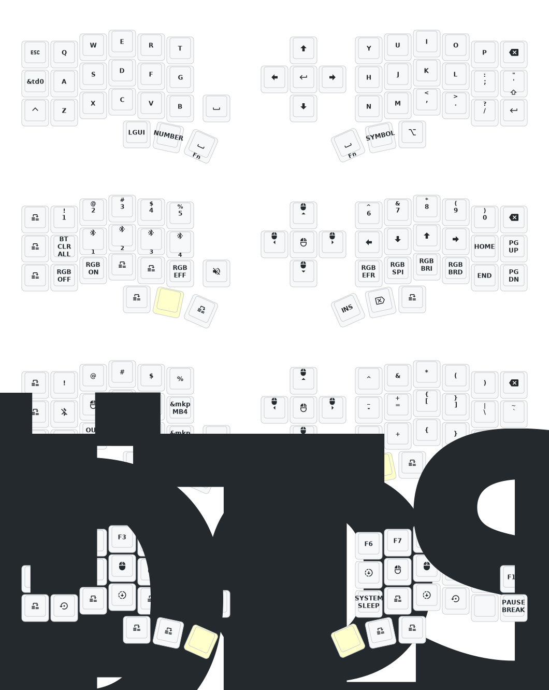

- [中文](README.md)
- [English](README_EN.md)
- [한글, Korean]

영어/한국어 눈꺼플 corne 키맵 정식 발표

중국산 눈썹 코르네(Eyelash Corne, 睫毛 corne) 키보드의 영문/한글 타이핑 고속화 키맵

 일본인 푸스탕이 올린 오리지널 코르네 키보드 [foostan's Corne](https://github.com/foostan/crkbd) 기반에서 문제점 발견. 일본어 입력 특화로 키맵에서 좌우 쉬프트 대칭 중복과 한영, 한자 전원 매핑이 없음.
 실제로 

如果您需要该键盘的 3D 模型，请发送电子邮件至 `380465425@qq.com`。

## 使用说明

1. [叉取此仓库](https://docs.github.com/en/get-started/quickstart/fork-a-repo#forking-a-repository)。
2. [点击 **Actions** 选项卡，确保工作流已启用](https://docs.github.com/en/actions/managing-workflow-runs-and-deployments/managing-workflow-runs/disabling-and-enabling-a-workflow#enabling-a-workflow)。
3. 确保 [`config/west.yml`](config/west.yml) 中的 `eyelash_corne` 项目仍然有效。`boards/arm/eyelash_corne` 文件夹将从此 URL 下载。
4. 如果您的叉取中仍存在 `boards/arm/eyelash_corne` 文件夹，请将其删除。

**如果您已经有 ZMK 配置仓库，[您可以将此作为模块添加，而不是叉取](https://zmk.dev/docs/features/modules#building-with-modules)。**

## Corne 键位图

